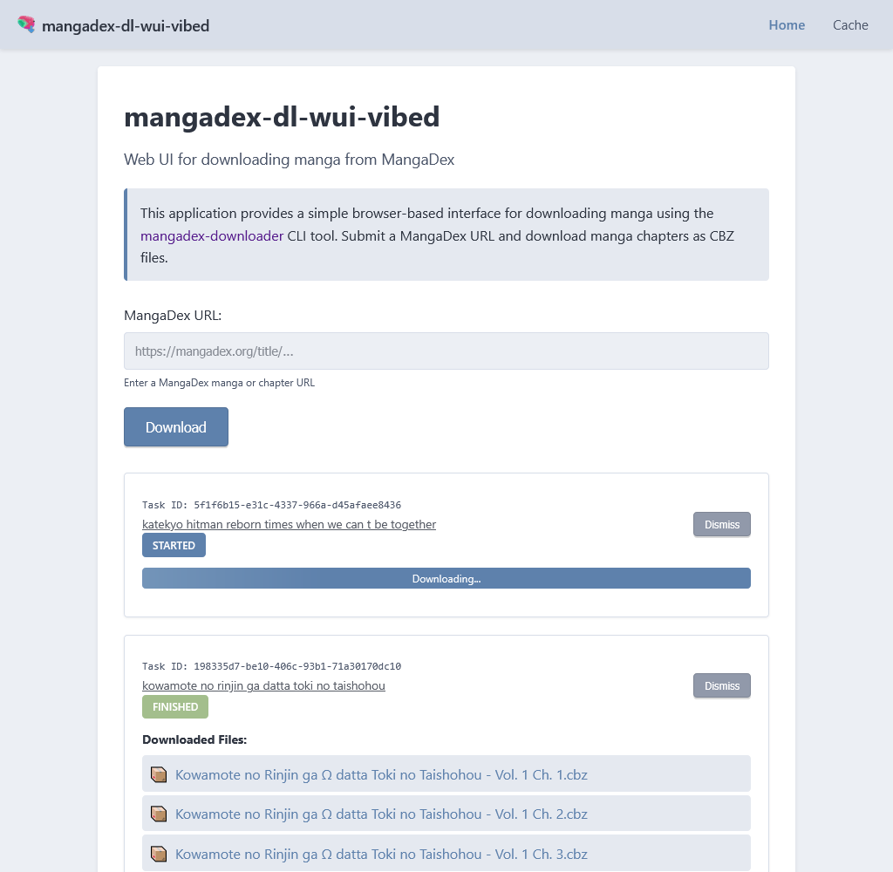

# mangadex-dl-wui-vibed


A web-based user interface for [mangadex-downloader](https://github.com/mansuf/mangadex-downloader), providing a simple browser interface to download manga from MangaDex as CBZ files.



[](https://hub.docker.com/r/5mdt/mangadex-dl-wui-vibed)
[](https://quay.io/repository/5mdt/mangadex-dl-wui-vibed)
[](https://github.com/mansuf/mangadex-downloader)

## ⚠️ Disclaimer

**This project is for educational purposes only.**

- ❌ **Not affiliated** with [MangaDex.org](https://mangadex.org)
- ❌ **Not affiliated** with [mangadex-downloader](https://github.com/mansuf/mangadex-downloader) by @mansuf
- ✅ **Educational project** to demonstrate web UI development with Flask and job queuing
- 📚 **Users are responsible** for complying with MangaDex's Terms of Service and copyright laws

**Please support manga creators by purchasing official releases.**

## ✨ Features

- 🌐 **Browser-based UI** - No command-line knowledge required
- 📦 **CBZ Downloads** - Get manga chapters in Comic Book Archive format
- 🔄 **Background Processing** - Downloads run asynchronously using Redis Queue (RQ)
- 📊 **Real-time Status** - Live progress updates via polling
- 💾 **Smart Caching** - Avoid re-downloading previously fetched chapters
- 🔁 **Session Persistence** - Tasks survive page refreshes
- 📱 **Responsive Design** - Works on desktop and mobile devices
- ♿ **Accessible** - ARIA labels and keyboard navigation support

## 🚀 Quick Start

### Prerequisites

- Python 3.12+
- Redis 6.0+
- [mangadex-downloader](https://github.com/mansuf/mangadex-downloader) CLI tool

### Installation

```shell
# Clone the repository
git clone https://github.com/nett00n/mangadex-dl-wui-vibed.git
cd mangadex-dl-wui-vibed

# Create virtual environment
python3 -m venv .venv
source .venv/bin/activate

# Install dependencies
pip install -r requirements.txt

# Install mangadex-downloader
pip install mangadex-downloader

# Copy environment template
cp .env.example .env
# Edit .env if needed
```

### Running (Development)

#### Option 1: Local Development (Manual)

You need 3 terminal sessions:

```shell
# Terminal 1: Start Redis
redis-server

# Terminal 2: Start RQ worker
source .venv/bin/activate
rq worker --with-scheduler

# Terminal 3: Start Flask app
source .venv/bin/activate
flask --app app --debug run
```

Visit http://localhost:5000

#### Option 2: Docker Compose (Development)

Uses `docker-compose.dev.yml` with hot reload and debug mode:

```shell
# Start all services with hot reload
docker compose -f docker-compose.dev.yml up --build --watch

# Run in background
docker compose -f docker-compose.dev.yml up -d

# View logs
docker compose -f docker-compose.dev.yml logs -f

# Stop services
docker compose -f docker-compose.dev.yml down
```

Visit http://localhost:5000

**Features:**
- 🔄 Hot reload - code changes automatically restart the app
- 🐛 Debug mode - detailed error messages
- 📝 Verbose logging - see what's happening

### Running (Production - Pre-built Image)

A pre-built multi-arch image (`linux/amd64`, `linux/arm64`) is available on Docker Hub and Quay.io:

```
docker pull docker.io/5mdt/mangadex-dl-wui-vibed:release
# or
docker pull quay.io/5mdt/mangadex-dl-wui-vibed:release
```

| Tag            | Updated on           |
| -------------- | -------------------- |
| `release`      | every push to `main` |
| `v1.2.3`       | git tag pushes       |
| `sha-<commit>` | every build          |

#### Minimal docker-compose.yml

```yaml
services:
  app:
    image: docker.io/5mdt/mangadex-dl-wui-vibed:release
    restart: unless-stopped
    environment:
      REDIS_URL: redis://redis:6379/0
      CACHE_DIR: /downloads/cache
      TEMP_DIR: /tmp/mangadex-wui-vibed
      TASK_TTL_SECONDS: "3600"
      CACHE_TTL_SECONDS: "604800"
      RQ_WORKER_COUNT: "3"
      JOB_TIMEOUT_SECONDS: "3600"
    volumes:
      - downloads:/downloads/cache
    ports:
      - "5000:5000"
    depends_on:
      redis:
        condition: service_healthy

  worker:
    image: docker.io/5mdt/mangadex-dl-wui-vibed:release
    restart: unless-stopped
    command: rq worker --url redis://redis:6379/0
    environment:
      REDIS_URL: redis://redis:6379/0
      CACHE_DIR: /downloads/cache
      TEMP_DIR: /tmp/mangadex-wui-vibed
      TASK_TTL_SECONDS: "3600"
      CACHE_TTL_SECONDS: "604800"
      RQ_WORKER_COUNT: "3"
      JOB_TIMEOUT_SECONDS: "3600"
    volumes:
      - downloads:/downloads/cache
    depends_on:
      redis:
        condition: service_healthy

  redis:
    image: redis:7-alpine
    restart: unless-stopped
    volumes:
      - redis_data:/data
    healthcheck:
      test: ["CMD", "redis-cli", "ping"]
      interval: 10s
      timeout: 5s
      retries: 3

volumes:
  downloads:
  redis_data:
```

#### With Traefik and Watchtower

```yaml
services:
  app:
    image: docker.io/5mdt/mangadex-dl-wui-vibed:release
    restart: unless-stopped
    environment:
      REDIS_URL: redis://redis:6379/0
      CACHE_DIR: /downloads/cache
      TEMP_DIR: /tmp/mangadex-wui-vibed
      TASK_TTL_SECONDS: "3600"
      CACHE_TTL_SECONDS: "604800"
      RQ_WORKER_COUNT: "3"
      JOB_TIMEOUT_SECONDS: "3600"
    volumes:
      - downloads:/downloads/cache
    depends_on:
      redis:
        condition: service_healthy
    networks:
      - traefik_default
      - default
    labels:
      com.centurylinklabs.watchtower.enable: "true"
      traefik.docker.network: traefik_default
      traefik.enable: true
      traefik.http.routers.mangadex-dl-wui-vibed.entrypoints: websecure
      traefik.http.routers.mangadex-dl-wui-vibed.rule: Host(`${SERVICE_NAME_OVERRIDE:-mangadex-dl-wui-vibed}.${DOMAIN_NAME:-local}`)
      traefik.http.routers.mangadex-dl-wui-vibed.service: mangadex-dl-wui-vibed
      traefik.http.routers.mangadex-dl-wui-vibed.tls: true
      traefik.http.routers.mangadex-dl-wui-vibed.tls.certresolver: letsencrypt-cloudflare-dns-challenge
      traefik.http.services.mangadex-dl-wui-vibed.loadbalancer.server.port: 5000
      local.yacht.port.5000: WebUI

  worker:
    image: docker.io/5mdt/mangadex-dl-wui-vibed:release
    restart: unless-stopped
    command: rq worker --url redis://redis:6379/0
    environment:
      REDIS_URL: redis://redis:6379/0
      CACHE_DIR: /downloads/cache
      TEMP_DIR: /tmp/mangadex-wui-vibed
      TASK_TTL_SECONDS: "3600"
      CACHE_TTL_SECONDS: "604800"
      RQ_WORKER_COUNT: "3"
      JOB_TIMEOUT_SECONDS: "3600"
    volumes:
      - downloads:/downloads/cache
    depends_on:
      redis:
        condition: service_healthy
    networks:
      - default

  redis:
    image: redis:7-alpine
    restart: unless-stopped
    volumes:
      - redis_data:/data
    healthcheck:
      test: ["CMD", "redis-cli", "ping"]
      interval: 10s
      timeout: 5s
      retries: 3

volumes:
  downloads:
  redis_data:

networks:
  traefik_default:
    external: true
```

Set `DOMAIN_NAME` and optionally `SERVICE_NAME_OVERRIDE` in your `.env` file or environment.

### Running (Production - Docker)

```shell
# Build and start all services
docker compose up --build

# Run in background
docker compose up -d

# View logs
docker compose logs -f

# Stop services
docker compose down
```

## 📖 Usage

1. Open the web interface in your browser
2. Paste a MangaDex URL (manga or chapter):
   - `https://mangadex.org/title/{uuid}/{slug}`
   - `https://mangadex.org/chapter/{uuid}`
3. Click "Download"
4. Monitor the download progress in the task card
5. Download the CBZ file(s) when complete

## 🏗️ Architecture

```
Browser --> Flask (routes.py) --> Redis Queue (RQ) --> Worker --> subprocess: mangadex-dl
   ^                                   |                  |
   |--- polling /api/status/<id> ------|                  |
   |                                                       |
   |--- download /api/file/<id>/<file> --------------------|
```

**Key Components:**

- **Flask** - Web server and API endpoints
- **Redis + RQ** - Job queuing and background processing
- **Subprocess** - Safe execution of mangadex-dl CLI
- **SessionStorage** - Client-side task persistence

## 🛠️ Configuration

All configuration via environment variables (see `.env.example`):

| Variable              | Default                    | Description                               |
| --------------------- | -------------------------- | ----------------------------------------- |
| `REDIS_URL`           | `redis://localhost:6379/0` | Redis connection URL                      |
| `CACHE_DIR`           | `/downloads/cache`         | Persistent manga cache                    |
| `TEMP_DIR`            | `/tmp/mangadex-wui-vibed`  | Temporary task directories                |
| `TASK_TTL_SECONDS`    | `3600` (1 hour)            | Task record expiration                    |
| `CACHE_TTL_SECONDS`   | `604800` (7 days)          | Cached file expiration (0 = never expire) |
| `RQ_WORKER_COUNT`     | `3`                        | Concurrent download workers               |
| `JOB_TIMEOUT_SECONDS` | `3600` (1 hour)            | Max RQ job execution time                 |

## 🧪 Testing

```shell
# Activate virtual environment
source .venv/bin/activate

# Install dev dependencies
pip install -r requirements-dev.txt

# Run all tests with coverage
pytest --cov=app --cov-report=term-missing

# Run UI tests (requires Playwright)
pytest tests/test_ui.py -v

# Run specific test file
pytest tests/test_routes.py -v
```

## 🤝 Contributing

Contributions are welcome! Please see [CONTRIBUTING.md](CONTRIBUTING.md) for:

- Development setup
- Code quality standards
- Testing requirements
- API documentation
- Project architecture

## 📋 Project Structure

```
mangadex-dl-wui-vibed/
├── app/
│   ├── __init__.py          # Flask app factory
│   ├── routes.py            # HTTP endpoints
│   ├── downloader.py        # Safe subprocess wrapper
│   ├── worker.py            # RQ worker job definitions
│   ├── tasks.py             # Job queue helpers
│   ├── cleanup.py           # Background cleanup
│   ├── validators.py        # URL validation
│   ├── config.py            # Configuration
│   ├── templates/           # HTML templates
│   └── static/              # CSS, JavaScript
├── tests/                   # Test suite
├── docs/                    # Additional documentation
├── docker-compose.yml       # Docker Compose config
├── Dockerfile               # Container image
├── pyproject.toml           # Python project config
├── requirements.txt         # Production dependencies
├── requirements-dev.txt     # Development dependencies
└── .env.example             # Environment variable template
```

## 📄 License

This project is licensed under the GNU General Public License v3.0 (GPLv3) - see the [LICENSE.md](LICENSE.md) file for details.

**Key Points:**
- ✅ Free to use, modify, and distribute
- ✅ Source code must remain open source
- ✅ Changes must be documented
- ❌ No warranty provided

## 🔗 Related Projects

- [MangaDex](https://mangadex.org) - The manga reading platform
- [mangadex-downloader](https://github.com/mansuf/mangadex-downloader) - The CLI tool this project wraps
- [Flask](https://flask.palletsprojects.com/) - Python web framework
- [Redis Queue (RQ)](https://python-rq.org/) - Background job processing

## 💬 Support

- 📖 **Documentation**: See [CONTRIBUTING.md](CONTRIBUTING.md) for detailed docs
- 🐛 **Issues**: Report bugs via [GitHub Issues](https://github.com/nett00n/mangadex-dl-wui-vibed/issues)
- 💡 **Feature Requests**: Open an issue with the `enhancement` label

## ⚖️ Legal Notice

This software is provided "as is" without warranty of any kind. The authors and contributors are not responsible for any misuse of this software or violations of third-party terms of service.

Users must:
- Respect MangaDex's Terms of Service
- Comply with copyright laws in their jurisdiction
- Use this tool responsibly and ethically
- Support manga creators through official channels

---

**Neuroslopped with ✨Claude Code✨ for educational purposes**
